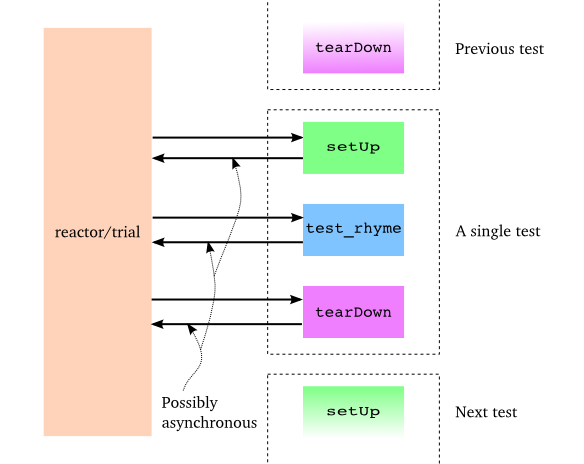

========================
第十五部分 测试诗歌
========================
你可以从":doc:`p01`"开始阅读；也可以从":doc:`index`"浏览索引.

简介
========
在我们探索Twisted的过程中写了很多代码,但目前我们却忽略了一些重要的东西 —— 测试.你也是会怀疑怎样用像 `unittest <http://docs.python.org/library/unittest.html#module-unittest>`_ 这样Python自带的同步框架测试异步代码.答案是你不能.正如我们已经发现的,同步代码和异步代码是不能混合的,至少不容易.

幸运地是,Twisted包含自己的测试框架,叫 `trial <http://twistedmatrix.com/documents/current/core/howto/testing.html>`_,它支持测试异步代码(当然你也可以用它测试同步代码).

我们假设你已经熟悉了 `unittest <http://docs.python.org/library/unittest.html#module-unittest>`_ 的机理和相似的测试框架,它允许你通过定义类创建测试.这个类通常是一个父类(通常叫"`TestCase`")的子类,类中的方法以"`test`"开头并被视作一个测试.框架负责发现所有的测试,一个接一个地运行它们,并伴有可选项 ``setUp`` 和 ``tearDown`` 步骤,之后报告结果.

例子
========
你可以在 `tests/test_poetry.py <https://github.com/jdavisp3/twisted-intro/blob/master/tests/test_poetry.py#L1>`_ 中找到一些关于测试的例子.为了确保我们所有的例子是自包含的(以便你不用担心PYTHONPAYH设置),我们将所有需要的代码拷贝到测试模块中.当然正常情况,你只需导入需要测试的模块.

这个例子既测试诗歌客户端又测试服务器,通过使用客户端从测试服务器抓取一首诗. 为了提供一个可供测试的诗歌服务器, 我们在测试案例中实现 `setUp <https://github.com/jdavisp3/twisted-intro/blob/master/tests/test_poetry.py#L70>`_ 方法:
::

	class PoetryTestCase(TestCase):

	    def setUp(self):
            	factory = PoetryServerFactory(TEST_POEM)
        	from twisted.internet import reactor
        	self.port = reactor.listenTCP(0, factory, interface="127.0.0.1")
        	self.portnum = self.port.getHost().port

这个 `setUp` 方法用一首测试诗建立诗歌服务器,然后监听一个随机开放端口.我们保存了端口号,以便实际测试需要时可以利用.当然测试结束时我们会用 `tearDown <https://github.com/jdavisp3/twisted-intro/blob/master/tests/test_poetry.py#L76>`_ 清除测试服务器:
::

	def tearDown(self):
    	    port, self.port = self.port, None
    	    return port.stopListening()

这把我们带到了第一个测试, `test_client <https://github.com/jdavisp3/twisted-intro/blob/master/tests/test_poetry.py#L80>`_, 用 `get_poetry` 从测试服务器获取诗歌并且验证这就是我们所期望的诗歌:
::

	def test_client(self):
    	    """The correct poem is returned by get_poetry."""
    	    d = get_poetry('127.0.0.1', self.portnum)
 
	    def got_poem(poem):
            	self.assertEquals(poem, TEST_POEM)
 
	    d.addCallback(got_poem)
 
	    return d

注意我们的测试函数返回一个 ``deferred``.在 ``trial`` 中,每个测试方法都以回调的方式运行.这意味着 ``reactor`` 正在运行并且我们可以以测试的一部分执行异步操作.我们仅仅需要让框架知道测试是异步的,这可以通过采用常规的Twisted方式 —— 返回 ``deferred`` 来实现.

``trial`` 框架在调用 ``tearDown`` 方法之前将等待直到 ``deferred`` 激发,并且当 ``deferred`` 失败时将使测试失败(如,最后一个回调/错误回调对失败).如果我们的 ``deferred`` 反应太慢(默认2分钟)它同样会使测试失败.这意味着如果测试完成,我们知道 ``deferred`` 激发了,因此我们的回调激发了并且运行了 ``assertEquals`` 测试方法.

我们的第二个测试, `test_failure <https://github.com/jdavisp3/twisted-intro/blob/master/tests/test_poetry.py#L91>`_, 证实 `get_poetry` 以适当的方式失败了,如果不能连接到服务器:
::

	def test_failure(self):
    	    """The correct failure is returned by get_poetry when
    	    connecting to a port with no server."""
    	    d = get_poetry('127.0.0.1', -1)
    	    return self.assertFailure(d, ConnectionRefusedError)

这里我们打算连接到一个无效端口,之后使用trial提供的 ``assertFailure`` 方法.这个方法类似于熟悉的 ``assertRaises`` 方法但是是针对异步代码的.它返回一个 ``deferred``,如果给定的 ``deferred`` 失败则返回成功,否则返回失败.

你可以用trial脚本自己运行这些测试,如下:
::

	trial tests/test_poetry.py

你将看到显示每个测试案例的输出,OK表示测试通过了.

讨论
=========
由于当谈到基本API时,trial与unittest十分相似,所以开始写测试十分容易.如果你的测试使用异步代码,仅仅返回 ``deferred`` 就可以了,trial将负责其余的事情.你也可以从 ``setUp`` 或 ``tearDown`` 方法返回一个 ``deferred``,如果它们也需要异步.

任何来自测试的日志消息将被收集到当前文件夹下的一个文件中,即"`_trial_temp`", trial会自动创建它. 除了打印到屏幕的错误,日志是调试失败测试的实用入口.

图33显示了一个正在进行中的假想测试：

.. _图33:

|  图33: 进行中的trial测试

如果你之前使用过类似的框架,这是一个熟悉的模型,除了所有测试相关的方法可能返回 ``deferreds``.

trial框架是一个关于如何"异步运作"的很好例子,包括级联在整个程序中的变化.为了使一个测试(或任何函数,方法)是异步的,它必须:

1. 非阻塞并且,通常
2. 返回一个 ``deferred``.

但这意味着无论什么调用,那个函数必须愿意接收一个 ``deferred``,并且非阻塞(如此又好像返回了一个 ``deferred``).如此这般一层又一层.这样就呼唤出现trial一样的框架,可以处理返回 ``deferreds`` 的异步测试.

总结
========
这就是关于单元测试的内容.如果你想了解更多关于如何为Twisted代码写单元测试的例子,你只需要看看Twisted代码本身.Twisted框架自带了一套非常庞大的单元测试,而且每个新的发布又会加入很多.由于这些测试在被接受入代码库之前,经过严格的代码评论以及Twisted专家们的仔细审查,故而它们是告诉你如何以正确方式测试Twisted代码的极好例子.

在 :doc:`p16` 中,我们将使用Twisted工具将诗歌服务器转化为一个真正的守护进程.

参考练习
=========
1. 改变测试之一使其失败,然后再次运行 ``trial`` 看看输出结果.
2. 阅读 `trial 在线文档 <http://twistedmatrix.com/documents/current/core/howto/testing.html>`_.
3. 为我们这个系列中所创建的其他诗歌服务写测试.
4. 探索Twisted中的 `一些测试 <http://twistedmatrix.com/trac/browser/trunk/twisted/test>`_.
