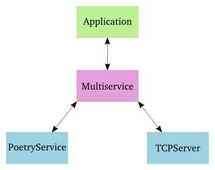

==============================
第十六部分 Twisted 进程守护
==============================
你可以从":doc:`p01`"开始阅读；也可以浏览":doc:`index`"的索引

简介
------
目前我们所写的服务器仅仅运行在终端窗口，结果通过 ``print`` 语句输出到屏幕.这对于开发来说已经足够，但对于产品级的部署还远远不够. 健壮的产品级服务器应该：

#. 运行一个 `daemon <http://en.wikipedia.org/wiki/Daemon_%28computer_software%29>`_ 进程,这个进程不与任何终端或用户会话相关.因为没有人愿意当某用户登出时服务自动关闭.
#. 将调试和错误信息发送到一系列滚转日志文件, 或者 `syslog <http://en.wikipedia.org/wiki/Syslog>`_ 服务.
#. 放弃过高的权限,比如,在运行前切换到较低权限.
#. 保存它的 `pid <http://en.wikipedia.org/wiki/Process_ID>`_ 文件以便管理员方便地向 daemon  `发送信号 <http://en.wikipedia.org/wiki/Kill%28%29>`_. 

我们可以利用Twisted提供的 ``twistd`` 脚本获得所有以上功能. 但是首先需要稍稍修改我们的代码.    

IService
-----------
`IService <http://twistedmatrix.com/trac/browser/tags/releases/twisted-10.0.0/twisted/application/service.py#L87>`_ 接口定义了一个可以启动或停止的服务. 这个服务究竟做了些什么? 答案是任何你喜欢的事情——这个接口只需要自提供的一些通用属性和方法,无须用户定义特定的函数.

这边有两个需要的属性: ``name`` 和 ``running``.其中 ``name`` 属性是一个字符串,如 "`fastpoetry`",或者 `None` 如果你不想给这个服务起名字. ``running`` 属性是 **Boolean** 变量,如果服务成功启动,值为 `True`.

下面我们只涉及 ``IService`` 的某些方法, 跳过那些很显然的或者在更简单的Twisted程序中用不到的高级方法. `startService <http://twistedmatrix.com/trac/browser/tags/releases/twisted-10.0.0/twisted/application/service.py#L130>`_ 和 `stopService <http://twistedmatrix.com/trac/browser/tags/releases/twisted-10.0.0/twisted/application/service.py#L135>`_ 是 ``IService`` 的两个关键方法：
::

        def startService():
            """
            Start the service.
            """

        def stopService():
            """
            Stop the service.

            @rtype: L{Deferred}
            @return: a L{Deferred} which is triggered when the service has
                finished shutting down. If shutting down is immediate, a
                value can be returned (usually, C{None}).
            """

同样,这些方法做什么取决于服务的需求,比如 ``startService`` 可能会:

* 加载配置数据,或
* 初始化数据库,或
* 开始监听某端口,或
* 什么也不做.

``stopService`` 可能会:

* 储存状态,或
* 关闭打开的数据库连接,或
* 停止监听某端口,或
* 什么也不做.

当我们写自定义服务时, 要恰当地实现这些方法.对于一些通用的行为,比如监听某端口,Twisted提供了现成的服务可以使用. 

注意 ``stopService`` 可以选择地返回 `deferred`,要求当服务完全关闭时被激发.这允许我们的服务在结束之后与整个程序终止之前完成清理工作.如果你需要服务立即关闭,可以仅仅返回 `None` 而不是 `deferred`.

服务可以被组织成集合以便一起启动和停止.下面来看看这里最后一个 ``IService`` 方法: `setServiceParent <http://twistedmatrix.com/trac/browser/tags/releases/twisted-10.0.0/twisted/application/service.py#L107>`_,它添加一个服务到集合:
::

	def setServiceParent(parent):
    	    """
    	    Set the parent of the service.
 
	    @type parent: L{IServiceCollection}
    	    @raise RuntimeError: Raised if the service already has a parent
	        or if the service has a name and the parent already has a child 
		by that name.
	    """

任何服务都可以有双亲,这意味着服务可以被组织为层级结构.这把我们引向了今天讨论的另一个接口.

IServiceCollection
---------------------
`IServiceCollection <http://twistedmatrix.com/trac/browser/tags/releases/twisted-10.0.0/twisted/application/service.py#L203>`_ 接口定义了一个对象，它可包含若干个 ``IService`` 对象.一个服务集合仅仅是一个普通的类容器,具有以下方法:

* 通过名字查找某服务( `getServiceNamed <http://twistedmatrix.com/trac/browser/tags/releases/twisted-10.0.0/twisted/application/service.py#L212>`_ )
* 遍历集合中的服务( `__iter__ <http://twistedmatrix.com/trac/browser/tags/releases/twisted-10.0.0/twisted/application/service.py#L222>`_)
* 添加一个服务到集合( `addService <http://twistedmatrix.com/trac/browser/tags/releases/twisted-10.0.0/twisted/application/service.py#L227>`_)
* 从集合中移除一个服务( `removeService <http://twistedmatrix.com/trac/browser/tags/releases/twisted-10.0.0/twisted/application/service.py#L236>`_)

Application
--------------
一个Twisted ``Application`` 不是通过一个单独的接口定义的.相反, ``Application`` 对象需要实现 ``IService`` 和 ``IServiceCollection`` 接口以及一些我们未曾涉及的接口.

``Application`` 是一个代表你整个Twisted应用的最顶层的服务. 在你 ``daemon`` 中的所有其他服务将是这个 ``Application`` 对象的儿子(甚至孙子,等等.).

其实需要你自己实现 ``Application`` 的机会很小,Twisted已经提供了一个当下常用的实现. 

Twisted Logging
-------------------
Twisted在其模块 `twistd.python.log <http://twistedmatrix.com/trac/browser/tags/releases/twisted-10.0.0/twisted/python/log.py>`_ 中包含了其自身的日志架构.由于写日志的基本 **API** 非常简单, 我们仅仅介绍一个小例子： `basic-twisted/log.py`,如果你感兴趣更多细节可以浏览Twisted模块.

我们也不详细介绍安装日志处理程序的 **API**,因为 `twistd` 脚本会帮我们做.

FastPoetry 2.0
-----------------------
好吧,让我们看看代码.我们已经将快诗服务器升级为使用 `twistd`. 源码在 `twisted-server-3/fastpoetry.py <https://github.com/jdavisp3/twisted-intro/blob/master/twisted-server-3/fastpoetry.py#L1>`_. 首先我们有了 `诗歌协议 <https://github.com/jdavisp3/twisted-intro/blob/master/twisted-server-3/fastpoetry.py#L9>`_:
::

	class PoetryProtocol(Protocol):
  
	    def connectionMade(self):
            	poem = self.factory.service.poem
        	log.msg('sending %d bytes of poetry to %s'
                 	% (len(poem), self.transport.getPeer()))
        	self.transport.write(poem)
        	self.transport.loseConnection()

注意没有使用 ``print`` 语句,而是使用 ``twisted.python.log.msg`` 函数去记录每个新连接.

这里是 `工厂类 <https://github.com/jdavisp3/twisted-intro/blob/master/twisted-server-3/fastpoetry.py#L19>`_:
::

	class PoetryFactory(ServerFactory):
	     
	      protocol = PoetryProtocol

	      def __init__(self, service):
              	  self.service = service

正如你看到的，诗不再储存在工厂中，而是储存在一个被工厂引用的服务对象上。注意这边协议是如何通过工厂从服务获得诗歌.最后,看一下 `服务类 <https://github.com/jdavisp3/twisted-intro/blob/master/twisted-server-3/fastpoetry.py#L27>`_:
::
	
	class PoetryService(service.Service):

		def __init__(self, poetry_file):
        	    self.poetry_file = poetry_file

		def startService(self):
        	    service.Service.startService(self)
        	    self.poem = open(self.poetry_file).read()
        	    log.msg('loaded a poem from: %s' % (self.poetry_file,))

| 就像许多其他接口类一样,Twisted提供了一个基类供自定义实现,同时具有方便的默认行为.
| 我们使用 `twisted.application.service.Service <http://twistedmatrix.com/trac/browser/tags/releases/twisted-10.0.0/twisted/application/service.py#L154>`_ 类实现 ``PoetryService``.

这个基类提供了所有必要方法的默认实现,所以我们只需要实现个性化的行为.在上面的例子中,我们只重载了 ``startService`` 方法来加载诗歌文件.注:我们仍然调用了相应的基类方法(它为我们设置 ``running`` 属性).

另外值得一提的是： ``PoetryService`` 对象不知道关于 ``PoetryProtocol`` 的任何细节.这里服务的任务仅仅是加载诗歌以及为其他需要诗歌的对象提供接口.也就是说, ``PoetryService`` 只关心提供诗歌的更高层的细节,而不是关心诸如通过 **TCP** 连接发送诗歌这样的更底层的细节.所以同样的服务可以被另外的协议使用,如 **UDP** 或 **XML-RPC**.虽然对于简单的服务好处不大,但你可以想象其在更实际服务实现中的优势.

如果这是一个典型的Twisted程序,到目前我们看到的代码都不该出现在这个文件里.它们应该在一些模块当中(也许是 ``fastpoetry`` 和 ``fastpoetry.service``).但是,遵循我们的惯例会使这些例子自包含,也就是在一个脚本中包含了所有东西.

Twisted tac files
-------------------------
这个脚本的其余部分包含通常作为完整内容的 ``Twisted tac`` 文件. ``tac`` 文件是一个 ``Twisted Application Configuration`` 文件,它告诉 ``twistd`` 怎样去构建一个应用.作为一个配置文件,它负责选择设置(如端口,诗歌文件位置,等)来以一种特定的方式运行这个应用.换句话说, ``tac`` 代表我们服务的一个特定部署(在这个端口服务这首诗),而不是启动任何诗歌服务的一般脚本.

如果我们在同一个域运行多个诗歌服务,我们将为每一个服务准备一个 ``tac`` 文件(因此你可以明白为什么 ``tac`` 文件通常不包含任何一般目的的代码).在我们的例子中, ``tac`` 文件被配置为使 ``poetry/ecstasy.txt`` 运行在回环接口的10000号端口:
::

	# configuration parameters
	port = 10000
	iface = 'localhost'
	poetry_file = 'poetry/ecstasy.txt'

注意 ``twistd`` 并不知道这些特定变量,我们仅仅将这些配置值统一的放在这里.事实上, ``twistd`` 只关心整个文件中的一个变量,我们即将看到.下面我们开始建立我们的应用:
::
	
	# this will hold the services that combine to form the poetry server
	top_service = service.MultiService()

我们的诗歌服务器将包含两个服务, 上文定义的 ``PoetryService``,和一个Twisted的内置服务,它将建立服务我们诗歌的监听套接字.由于这两个服务明显的相关,我们用 ``MultiService`` 将它们组织在一起,一个实现 ``IServiceCollection`` 和 ``IService`` 的类.

作为一个服务集合, ``MultiService`` 把我们的诗歌服务组织在一起.同时作为一个服务, ``MultiService`` 启动时将启动它的子服务,关闭时将关闭它的子服务.让我们向服务集合 `添加 <https://github.com/jdavisp3/twisted-intro/blob/master/twisted-server-3/fastpoetry.py#L48>`_ 第一个诗歌服务:
::

	# the poetry service holds the poem. it will load the poem when it is
	# started
	poetry_service = PoetryService(poetry_file)
	poetry_service.setServiceParent(top_service)

这是非常简单的内容.我们仅创建了 ``PoetryService``,然后用 ``setServiceParent`` 方法将其添加到服务集合.下面我们添加 **TCP** 监听器:
::

	# the tcp service connects the factory to a listening socket. it will
	# create the listening socket when it is started
	factory = PoetryFactory(poetry_service)
	tcp_service = internet.TCPServer(port, factory, interface=iface)
	tcp_service.setServiceParent(top_service)

Twisted为创建连接到任意工厂的 **TCP** 监听套接字提供了 ``TCPServer`` 服务(这里是 ``PoetryFactory``),我们没有直接调用 ``reactor.listenTCP`` 因为 ``tac`` 文件的工作是使我们的应用准备好开始,而不是实际启动它. 这里 ``TCPServer`` 将在被 ``twistd`` 启动后创建套接字.

你可能注意到我们没有为任何服务起名字.为服务起名不是必需的,而仅是一个可选项,如果你希望在运行时查找服务.因为我们不需要这个功能,所以这里没有为服务命名.

既然我们已经将两个服务绑定到服务集合.现只需创建我们的应用,并且将它添加到集合:
::

	# this variable has to be named 'application'
	application = service.Application("fastpoetry")

	# this hooks the collection we made to the application
	top_service.setServiceParent(application)

在这个脚本中 ``twistd`` 所关心的唯一变量就是 `application`. ``twistd`` 正是通过它找到那个需要启动的应用(所以这个变量必须被命名为 `applicaton`).当应用被启动时,我们添加到它的所有服务都会被启动.

图34显示了我们刚刚建立的应用的结构:

.. _figure34:

         
| 图34: fastpoetry 应用的结构图

Running the Server
------------------------
让我们的新服务器运转起来.作为 ``tac`` 文件,我们需要用 ``twistd`` 启动它.当然,它仅仅是一个普通的Python文件.所以我们首先用 ``python`` 命令启动,再看看会发生什么:
::

	python twisted-server-3/fastpoetry.py

如果你这样做,会发现什么也没有发生！正如前文所述, ``tac`` 文件的工作是使我们的应用准备好运行,而不是实际运行它.作为 ``tac`` 文件这个特殊目的的提醒,人们将它的扩展名规定为 `.tac` 而不是 `.py`.但是 ``twistd`` 脚本实际并不区分扩展名.

让我们用 ``twistd`` 脚本来实际运行这个服务器:
::

	twistd --nodaemon --python twisted-server-3/fastpoetry.py

运行以上命令后会看到如下输出:
::

	2010-06-23 20:57:14-0700 [-] Log opened.
	2010-06-23 20:57:14-0700 [-] twistd 10.0.0 (/usr/bin/python 2.6.5) starting up.
	2010-06-23 20:57:14-0700 [-] reactor class: twisted.internet.selectreactor.SelectReactor.
	2010-06-23 20:57:14-0700 [-] __builtin__.PoetryFactory starting on 10000
	2010-06-23 20:57:14-0700 [-] Starting factory <__builtin__.PoetryFactory instance at 0x14ae8c0>
	2010-06-23 20:57:14-0700 [-] loaded a poem from: poetry/ecstasy.txt

需要注意的几点:

1. 你可以看到Twisted日志系统的输出, 包括 ``PoetryFactory`` 调用 ``log.msg``.但是我们在 ``tac`` 文件中没有安装 ``logger``, 所以 ``twistd`` 会帮我们安装.
2. 你可以看到我们的两个主要服务 ``PoetryService`` 和 ``TCPServer`` 启动了.
3. shell提示符不会返回. 这表明我们的服务器没有以守护进程方式运行. 默认地, ``twistd`` 会以守护进程方式运行服务器(这正是 ``twistd`` 存在的原因), 但是如果你包含"``--nodaemon``" 选项,那么 ``twistd`` 将以一个常规shell进程的方式运行你的服务器,同时会将日志输出导向到标准输出. 这对于调试 ``tac`` 文件非常有用.

下面测试取诗服务器, 通过我们的诗歌代理或者 ``netcat`` 命令:
::

	netcat localhost 10000

这将从服务器抓取诗歌,并且你可以看到一行如下的日志:
::

	2010-06-27 22:17:39-0700 [__builtin__.PoetryFactory] sending 3003 bytes of poetry to IPv4Address(TCP, '127.0.0.1', 58208)

这个日志来自 ``PoetryProtocol.connectionMade`` 方法调用 ``log.msg``.当你向服务器发送更多请求时, 你将看到更多的日志条目.

现在可以用 ``Ctrl-C`` 来终止这个服务器. 你可以看到如下输出:
::

	^C2010-06-29 21:32:59-0700 [-] Received SIGINT, shutting down.
	2010-06-29 21:32:59-0700 [-] (Port 10000 Closed)
	2010-06-29 21:32:59-0700 [-] Stopping factory <__builtin__.PoetryFactory instance at 0x28d38c0>
	2010-06-29 21:32:59-0700 [-] Main loop terminated.
	2010-06-29 21:32:59-0700 [-] Server Shut Down.

正如你看到的, Twisted并没有简单地崩溃, 而是优雅地关闭并将日志信息告诉你.

好啦, 现在再次启动服务器:
::

	twistd --nodaemon --python twisted-server-3/fastpoetry.py

现在打开另一个shell并切换到 ``twisted-intro`` 目录. 其中有一个叫 `twistd.pid` 的文件. 它是被 ``twistd`` 创建的, 包含我们这个运行服务器进程号. 试一下下面的方法来关闭服务器:
::

	kill `cat twistd.pid`

注意当服务器关闭后, `twistd.pid` 文件消失了, 它被 ``twistd`` 清理了.

A Real Daemon
---------------------
现在让我们以守护进程的方式启动服务器, 这是 ``twistd`` 的默认方式:
::

	twistd --python twisted-server-3/fastpoetry.py

这次我们立即看到shell提示符返回. 当你列出目录中的文件时,会发现除了 `twistd.pid` 文件,又出现了 `twistd.log` 文件,它记录了之前显示在shell窗口的日志信息.

当启动一个守护进程时, ``twistd`` 安装一个日志管理器将条目写入一个文件而不是标准输出. 默认的日志文件是 `twistd.log`, 它出现在你运行 ``twistd`` 的目录中,但是你可以通过"``--logfile``"来改变它的位置. ``twistd`` 安装的的日志管理器将滚动输出日志信息, 确保其不超过 `1M`.

你可以通过列出操作系统上的所有进程来查看正在运行的服务器. 你不妨通过取另一首诗来测试这个服务器. 你可以看到记录每个诗歌请求的新条目出现在日志文件中.

由于这个服务器不再与shell相连(或者除了 `init <http://en.wikipedia.org/wiki/Init>`_ 的任何其他进程), 你不能通过 ``Ctrl-C`` 关闭它. 作为一个真的守护进程, 即使你登出它也继续运行.但是你可以通过 `twistd.pid` 文件终止这个进程:
::

	kill `cat twistd.pid`

随后, 关闭消息出现在日志文件中, ``twistd.pid`` 文件被移除, 服务器停止.

检查一下其他的 ``twistd`` 启动选项是个不错的主意. 例如,你可以告诉 ``twistd`` 在启动进程守护前切换到另一个用户或组账户(是一种当你的服务器不需要安全防范措施取消权限的典型方法). 我们就不进一步探讨那些额外的选项了,你可以通过 ``twistd`` 的 ``--help`` 自己研究它们.

Twisted 插件系统
====================
现在我们已经通过 ``twistd`` 启动真正的守护进程服务器. 这非常完美,而且事实上我们的配置文件是纯Python源码文件,这一点为我们设置带来巨大便利. 但是我们有时用不到这样的便利性.对于诗歌服务器,我们通常只关心一小部分选项:

1. 需要服务的诗歌
2. 服务端口
3. 监听接口

为了几个简单的变量建立一个 ``tac`` 文件显得有点小题大做. 如果我们能够通过 ``twistd`` 选项指定这些值将非常方便. Twisted的插件系统允许我们可以这样做.

Twisted插件通过定义 ``Application`` 提供了一种方法, 可以实现个性化的命令行选项, 进而 ``twistd`` 动态的发现和运行. Twisted本身具有一套插件,你可以通过运行不带参数的 ``twistd`` 命令来查看它们. 现在就试一试, 在 ``twisted-intro`` 目录外. 在帮助部分后面,你可以看到如下输出:
::

        ...
        ftp                An FTP server.
        telnet             A simple, telnet-based remote debugging service.
        socks              A SOCKSv4 proxy service.
        ...

| 每一行显示了一个Twisted内置的插件, 你可以用 ``twistd`` 运行它们.
| 每个插件同样有它们自己的选项,你可以通过 ``--help`` 来发现它们. 让我们看看 ``ftp`` 插件有什么选项:

::

	twistd ftp --help

注意我们需要将 ``--help`` 放在 ``ftp`` 后面而不是 ``twistd`` 后面, 因为我们想得到 ``ftp`` 的可选项.

我们可以像运行诗歌服务器一样运行 ``ftp`` 服务器. 但由于它是一个插件,我们可以仅仅通过它的名字运行:
::

	twistd --nodaemon ftp --port 10001

以上命令以非守护进程的方式在端口 `10001` 上运行 ``ftp`` 插件. 注意 ``twistd`` 的 `nodaemon` 选项出现在插件名字的前面,插件特定选项 `port` 出现在插件名字的后面. 正如我们的诗歌服务器一样,你可以用 ``Ctrl-C`` 停止它.

OK, 让我们把诗歌服务器转化为Twisted的插件. 首先我们需要介绍一些新概念.

IPlugin
------------
任何Twisted插件都需要实现 `twisted.plugin.IPlugin <http://twistedmatrix.com/trac/browser/tags/releases/twisted-10.0.0/twisted/plugin.py#L38>`_ 接口. 如果你浏览这个接口的声明, 你会发现它没有指定任何方法. 实现 ``IPlugin`` 接口仅仅相当于一个插件在说："你好,我是插件！"以便 ``twistd`` 找到它. 当然,出于实用考虑,它需要实现一些其他接口,我们很快会介绍.

但是你怎样知道一个对象实现了一个空接口? ``zope.interface`` 包含了一个叫做 `implements` 的函数,它可以用来声明一个特定类实现了一个特定的接口. 我们将在插件版的诗歌服务器中看到这种使用.

IServiceMaker
-------------------
除了 ``IPlugin``,我们的插件还实现 ``IServiceMaker`` 接口. 一个实现了 ``IServiceMaker`` 接口的对象知道如何创建 ``IService``,它将成为运行程序的核心. ``IServiceMaker`` 指定了三个属性和一个方法:

1. `tapname`: 代表插件名字的字符串. "`tap`"代表"Twisted Application Plugin". 注:老版本的Twisted还使用"`tapfiles`"文件,不过这个功能现在已经取消了.
2. `description`: 插件的描述, ``twistd`` 将以它作为帮助信息输出.
3. `options`: 一个代表这个插件接受的命令行选项的对象.
4. `makeService`: 一个创建 ``IService`` 对象的方法,需提供一些特定的命令行选项.

我们将在下一个版本的诗歌服务器中看到怎样将上述内容组织在一起.

Fast Poetry 3.0
=====================
现在我们已经为插件版本的"`Fast Poetry`"做好准备,它位于 `twisted/plugins/fastpoetry_plugin.py <https://github.com/jdavisp3/twisted-intro/blob/master/twisted/plugins/fastpoetry_plugin.py#L1>`_.

你可能注意到与其他例子不同, 我们命名了一个不同的目录. 这是因为 ``twistd`` 需要插件文件位于 `twisted/plugins` 目录中, 同时在你的Python搜索路径上. 这个目录不必是一个包(也就是, 不必包含任何 `__init__.py` 文件), 而且在路径上可以有多个 `twisted/plugins` 目录, ``twistd`` 都会找到它们. 这个插件的实际文件名是什么也没有关系, 但是一个好的方案是根据应用所代表的含义来命名, 就像我们在这里做的.

我们的插件开头部分同样包括诗歌协议,工厂,以及像 ``tac`` 文件中所实现的服务.如前所述,这些代码通常应该单独的存在于一个模块中,但出于我们例子自包含的目的,还是将它们放在插件文件中.

下面将 `声明 <https://github.com/jdavisp3/twisted-intro/blob/master/twisted/plugins/fastpoetry_plugin.py#L45>`_ 这个插件的命令行选项:
::

	class Options(usage.Options):

	      optParameters = [
	      	  ['port', 'p', 10000, 'The port number to listen on.'],
        	  ['poem', None, None, 'The file containing the poem.'],
        	  ['iface', None, 'localhost', 'The interface to listen on.'],
              ]

| 以上代码指定可以放在 ``twistd`` 命令后面使用的插件特定选项的名字.
| 这里就不必进一步解释上述选项的含义了,其含义很显然. 下面我们来看一下插件的主要部分 `服务制造类 <https://github.com/jdavisp3/twisted-intro/blob/master/twisted/plugins/fastpoetry_plugin.py#L56>`_:

::

	class PoetryServiceMaker(object):
	     
	      implements(service.IServiceMaker, IPlugin)

	      tapname = "fastpoetry"
    	      description = "A fast poetry service."
    	      options = Options
          
	      def makeService(self, options):
              	  top_service = service.MultiService()

	      	  poetry_service = PoetryService(options['poem'])
              	  poetry_service.setServiceParent(top_service)
		 
		  factory = PoetryFactory(poetry_service)
              	  tcp_service = internet.TCPServer(int(options['port']), factory,
                                         interface=options['iface'])
	
		  tcp_service.setServiceParent(top_service)
		 
		  return top_service

这里你可以看到如何使用 ``zope.interface.implements`` 函数来声明我们的类同时实现 ``IServiceMaker`` 和 ``IPlugin`` 接口.

你应该从之前的 ``tac`` 文件辨认出 ``makeService`` 中的代码, 但是这次我们不需要自己建立一个 `Application` 对象, 我们仅仅创建并返回最顶层服务,这样我们的程序就可以运行, ``twistd`` 来处理其余的事情. 注意我们是如何使用 `options` 参数来提取插件传递给 ``twistd`` 的特定命令行选项.

定义了上述类, 还有 `一步 <https://github.com/jdavisp3/twisted-intro/blob/master/twisted/plugins/fastpoetry_plugin.py#L81>`_ :
::

	service_maker = PoetryServiceMaker()

``twistd`` 脚本会发现我们插件的实例并使用它构建最顶层服务. 与 ``tac`` 文件不同的是, 选择什么变量名没有关系, 关键是我们的对象实现了 ``IPlugin`` 和 ``IServiceMaker`` 接口.

既然已经创建了插件, 让我们运行它. 确保你位于 `twisted-intro` 目录中, 或者 `twisted-intro` 位于Python的搜索目录中. 下面单独运行 ``twistd``,你会看到"`fastpoetry`"是列出的插件之一,后面显示插件文件中定义的描述文字.

你同样会注意到 `twisted/plugins` 目录中出现了一个 `dropin.cache` 的新文件. 这个文件由 ``twistd`` 创建, 用来加速后续扫描插件的.

现在让我们获取一些关于插件的帮助信息:
::

	twistd fastpoetry --help
  
你可以看到关于 `fastpoetry` 插件选项的帮助性文字. 最后,运行这个插件:
::

	twistd fastpoetry --port 10000 --poem poetry/ecstasy.txt

这将以守护进程方式启动 `fastpoetry` 服务器. 与前面例子一样, 你会在当期文件夹看到 `twistd.pid` 和 `twistd.log` 文件. 测试完我们的服务器, 用一下命令关闭:
::

	kill `cat twistd.pid`

这就是如何制作Twisted插件的方法.

总 结
=============
在这个部分, 我们学习了将Twisted服务器转换到支持长时间运行的守护进程模式. 我们还涉及了Twisted日志系统以及如何使用 ``twistd`` 以守护进程模式启动一个Twisted应用程序, 即或者通过 ``tac`` 配置文件或者Twisted插件. 在 `第十七部分 <`p17`>`_ 部分, 我们将转向异步编程的更基本的主题和另外一种结构化Twisted回调函数的方法.

参 考 练 习
================
1. 修正 ``tac`` 文件以在另外一个端口服务另外一首诗. 使用另外一个 ``MultiService`` 对象以保持每首诗的服务是分离的.
2. 创建一个新的 ``tac`` 文件来启动一个诗歌代理服务器.
3. 修正插件文件使其可接受第二个可选诗歌文件和服务端口.
4. 为诗歌代理服务器创建一个新的插件.
