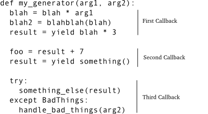
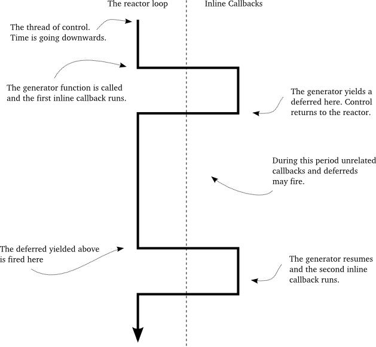

=====================================
第十七部分 构造"回调"的另一种方法
=====================================
你可以从":doc:`p01`"开始阅读；也可以浏览":doc:`index`"的索引

简介
=========
这部分我们将回到"回调"这个主题.我们将介绍另外一种写回调函数的方法,即在Twisted中使用 `generators <http://docs.python.org/tutorial/classes.html#generators>`_. 我们将演示如何使用这种方法并且与使用"纯" ``Deferreds`` 进行对比. 最后, 我们将使用这种技术重写诗歌客户端. 但首先我们来回顾一下 ``generators`` 的工作原理,以便弄清楚它为何是创建回调的候选方法.

简要回顾生成器
--------------------------------
你可能知道, 一个Python生成器是一个"可重启的函数",它是在函数体中用 ``yield`` 语句创建的. 这样做可以使这个函数变成一个"生成器函数",它返回一个"`iterator <http://docs.python.org/tutorial/classes.html#iterators>`_"可以用来以一系列步骤运行这个函数. 每个迭代循环都会重启这个函数,继续执行到下一个 ``yield`` 语句.

生成器(和迭代器)通常被用来代表以惰性方式创建的值序列. 看一下以下文件中的代码 `inline-callbacks/gen-1.py <https://github.com/jdavisp3/twisted-intro/blob/master/inline-callbacks/gen-1.py#L1>`_:
::

	def my_generator():
    	    print 'starting up'
    	    yield 1
    	    print "workin'"
    	    yield 2
    	    print "still workin'"
    	    yield 3
    	    print 'done'

	for n in my_generator():
    	    print n

这里我们用生成器创建了1,2,3序列. 如果你运行这些代码,会看到在生成器上做迭代时,生成器中的 ``print`` 与循环语句中的 ``print`` 语句交错出现.

以下自定义迭代器代码使上面的说法更加明显(`inline-callbacks/gen-2.py <https://github.com/jdavisp3/twisted-intro/blob/master/inline-callbacks/gen-2.py#L1>`_):
::

	def my_generator():
    	    print 'starting up'
    	    yield 1
    	    print "workin'"
    	    yield 2
    	    print "still workin'"
    	    yield 3
    	    print 'done'

	gen = my_generator()

	while True:
    	    try:
		n = gen.next()
    	    except StopIteration:
            	break
     	    else:
		print n

视作一个序列,生成器仅仅是获取连续值的一个对象.但我们也可以以生成器本身的角度看问题:

1. 生成器函数在被循环调用之前并没有执行(使用 ``next`` 方法).
2. 一旦生成器开始运行,它将一直执行直到返回"循环"(使用 ``yield``)
3. 当循环中运行其他代码时(如 ``print`` 语句),生成器则没有运行.
4. 当生成器运行时, 则循环没有运行(等待生成器返回前它被"阻滞"了).
5. 一旦生成器将控制交还到循环,再启动需要等待任意可能时间(其间任意量的代码可能被执行).

这与异步系统中的回调工作方式非常类似. 我们可以把 ``while`` 循环视作 ``reactor``, 把生成器视作一系列由 ``yield`` 语句分隔的回调函数. 有趣的是, 所有的回调分享相同的局部变量名空间, 而且名空间在不同回调中保持一致.

进一步,你可以一次激活多个生成器(参考例子 `inline-callbacks/gen-3.py <https://github.com/jdavisp3/twisted-intro/blob/master/inline-callbacks/gen-3.py#L1>`_),使得它们的"回调"互相交错,就像在Twisted系统中独立运行的异步程序.

然而,这种方法还是有一些欠缺.回调不仅仅被 ``reactor`` 调用, 它还能接受信息.作为 ``deferred`` 链的一部分,回调要么接收Python值形式的一个结果,要么接收 ``Failure`` 形式的一个错误.

从Python2.5开始,生成器功能被扩展了.当你再次启动生成器时,可以给它发送信息,如 `inline-callbacks/gen-4.py <https://github.com/jdavisp3/twisted-intro/blob/master/inline-callbacks/gen-4.py#L1>`_ 所示:
::

	class Malfunction(Exception):
    	    pass

	def my_generator():
    	    print 'starting up'
	   
	    val = yield 1
    	    print 'got:', val

	    val = yield 2
    	    print 'got:', val
    	   
	    try:
		yield 3
	    except Malfunction:
            	print 'malfunction!'

	    yield 4

	    print 'done'

	gen = my_generator()

	print gen.next() # start the generator
	print gen.send(10) # send the value 10
	print gen.send(20) # send the value 20
	print gen.throw(Malfunction()) # raise an exception inside the generator

	try:
	    gen.next()
	except StopIteration:
    	    pass

在Python2.5以后的版本中, ``yield`` 语句是一个计算值的表达式.重新启动生成器的代码可以使用 ``send`` 方法代替 ``next`` 决定它的值(如果使用 ``next`` 则值为 `None`), 而且你还可以在迭代器内部使用 ``throw`` 方法抛出任何异常. 是不是很酷?

内联回调
--------------
根据我们刚刚回顾的可以向生成器发送值或抛出异常的特性,可以设想它是像 ``deferred`` 中的一系列回调,即可以接收结果或错误. 每个回调被 ``yield`` 分隔,每一个 ``yield`` 表达式的值是下一个回调的结果(或者 ``yield`` 抛出异常表示错误).图35显示相应概念:

.. _figure35:

|   图35:作为回调序列的生成器

现在一系列回调以 ``deferred`` 方式被链接在一起,每个回调从它前面的回调接收结果.生成器很容易做到这一点——当再次启动生成器时,仅仅使用 ``send`` 发送上一次调用生成器的结果( ``yield`` 产生的值).但这看起来有点笨,既然生成器从开始就计算这个值,为什么还需要把它发送回来? 生成器可以将这个值储存在一个变量中供下一次使用. 因此这到底是为什么呢?

回忆一下我们在 :doc:`p13` 中所学, ``deferred`` 中的回调还可以返回 ``deferred`` 本身. 在这种情况下, 外层的 ``deferred`` 先暂停等待内层的 ``deferred`` 激发,接下来外层 ``deferred`` 链使用内层 ``deferred`` 的返回结果(或错误)激发后续的回调(或错误回调).

所以设想我们的生成器生成一个 ``deferred`` 对象而不是一个普通的Python值. 这时生成器会自动"暂停";生成器总是在每个 ``yield`` 语句后暂停直到被显示的重启.因而我们可以延迟它的重启直到 ``deferred`` 被激发, 届时我们会使用 ``send`` 方法发送值(如果 ``deferred`` 成功)或者抛出异常(如果 ``deferred`` 失败).这就使我们的生成器成为一个真正的异步回调序列,这正是 `twisted.internet.defer <http://twistedmatrix.com/trac/browser/tags/releases/twisted-10.1.0/twisted/internet/defer.py>`_ 中 `inlineCallbacks <http://twistedmatrix.com/trac/browser/tags/releases/twisted-10.1.0/twisted/internet/defer.py#L973>`_ 函数背后的概念.

进一步讨论内联回调
====================
考虑以下例程, 位于 `inline-callbacks/inline-callbacks-1.py <https://github.com/jdavisp3/twisted-intro/blob/master/inline-callbacks/inline-callbacks-1.py#L1>`_: 
::

	from twisted.internet.defer import inlineCallbacks, Deferred

	@inlineCallbacks
	def my_callbacks():
    	    from twisted.internet import reactor

	    print 'first callback'
    	    result = yield 1 # yielded values that aren't deferred come right back

	    print 'second callback got', result
    	    d = Deferred()
    	    reactor.callLater(5, d.callback, 2)
    	    result = yield d # yielded deferreds will pause the generator

    	    print 'third callback got', result # the result of the deferred

	    d = Deferred()
    	    reactor.callLater(5, d.errback, Exception(3))

	    try:
		yield d
    	    except Exception, e:
            	result = e

	    print 'fourth callback got', repr(result) # the exception from the deferred

	    reactor.stop()

	from twisted.internet import reactor
	reactor.callWhenRunning(my_callbacks)
	reactor.run()

运行这个例子可以看到生成器运行到最后并终止了 ``reactor``, 这个例子展示了 ``inlineCallbacks`` 函数的很多方面.首先, ``inlineCallbacks`` 是一个修饰符,它总是修饰生成器函数,如那些使用 ``yield`` 语句的函数. ``inlineCallbacks`` 的全部目的是将一个生成器按照上述策略转化为一系列异步回调.

第二,当我们调用一个用 ``inlineCallbacks`` 修饰的函数时,不需要自己调用 ``send`` 或 ``throw`` 方法.修饰符会帮助我们处理细节,并确保生成器运行到结束(假设它不抛出异常).

第三,如果我们从生成器生成一个非延迟值,它将以 ``yield`` 生成的值立即重启.

最后,如果我们从生成器生成一个 ``deferred``,它不会重启除非此 ``deferred`` 被激发.如果 ``deferred`` 成功返回,则 ``yield`` 的结果就是 ``deferred`` 的结果.如果 ``deferred`` 失败了,则 ``yield`` 会抛出异常. 注这个异常仅仅是一个普通的 ``Exception`` 对象,而不是 ``Failure``,我们可以在 ``yield`` 外面用 ``try/except`` 块捕获它们.

在上面的例子中,我们仅用 ``callLater`` 在一小段时间之后去激发 ``deferred``.虽然这是一种将非阻塞延迟放入回调链的实用方法,但通常我们会生成一个 ``deferred``,它是被生成器中其他的异步操作(如 `get_poetry`)返回的.

OK,现在我们知道了 ``inlineCallbacks`` 修饰的函数是如何运行的,但当你实际调用时会返回什么值呢?正如你认为的,将得到 ``deferred``.由于不能确切地知道生成器何时停止(它可能生成一个或多个 ``deferred``),装饰函数本身是异步的,所以 ``deferred`` 是一个合适的返回值.注:这个返回的 ``deferred`` 不是生成器中 ``yield`` 生成的 ``deferred``.相反,它在生成器完全结束(或抛出异常)后才被激发.

如果生成器抛出一个异常,那么返回的 ``deferred`` 将激发它的错误回调链,把异常包含在一个 ``Failure`` 中. 但是如果我们希望生成器返回一个正常值,必须使用 ``defer.returnValue`` 函数. 就像普通 ``return`` 语句一样,它也会终止生成器(实际会抛出一个特殊异常).例子 `inline-callbacks/inline-callbacks-2.py <https://github.com/jdavisp3/twisted-intro/blob/master/inline-callbacks/inline-callbacks-2.py#L1>`_ 说明了这两种可能.
			 
客户端7.0
--------------
让我们在新版本的诗歌客户端中加入 ``inlineCallbacks``,你可以在 `twisted-client-7/get-poetry.py <https://github.com/jdavisp3/twisted-intro/blob/master/twisted-client-7/get-poetry.py#L1>`_ 中查看源代码.也许你需要与客户端6.0—— `twisted-client-6/get-poetry.py <https://github.com/jdavisp3/twisted-intro/blob/master/twisted-client-6/get-poetry.py#L151>`_ 进行对比,它们的相对变化位于 `poetry_main <https://github.com/jdavisp3/twisted-intro/blob/master/twisted-client-7/get-poetry.py#L151>`_:
::

	def poetry_main():
    	    addresses = parse_args()

	    xform_addr = addresses.pop(0)

	    proxy = TransformProxy(*xform_addr)

	    from twisted.internet import reactor

	    results = []

	    @defer.inlineCallbacks
    	    def get_transformed_poem(host, port):
            	try:
		    poem = yield get_poetry(host, port)
        	except Exception, e:
            	    print >>sys.stderr, 'The poem download failed:', e
            	    raise

		try:
		    poem = yield proxy.xform('cummingsify', poem)
        	except Exception:
            	    print >>sys.stderr, 'Cummingsify failed!'

		defer.returnValue(poem)

	   def got_poem(poem):
               print poem

	   def poem_done(_):
               results.append(_)
               if len(results) == len(addresses):
               	   reactor.stop()

	   for address in addresses:
               host, port = address
               d = get_transformed_poem(host, port)
               d.addCallbacks(got_poem)
               d.addBoth(poem_done)

	   reactor.run()

在这个新版本里, ``inlineCallbacks`` 生成函数 `get_transformed_poem` 负责取回诗歌并且应用变换(通过变换服务).由于这两个操作都是异步的,我们每次生成一个 ``deferred`` 并且隐式地等待结果.与客户端6.0一样,如果变换失败则返回原始诗歌.我们可以使用 ``try/except`` 语句捕获生成器中的异步错误. 

我们以先前的方式测试新版客户端. 首先启动一个变换服务:
::

	python twisted-server-1/tranformedpoetry.py --port 10001

然后启动两个诗歌服务器:
::

	python twisted-server-1/fastpoetry.py --port 10002 poetry/fascination.txt
	python twisted-server-1/fastpoetry.py --port 10003 poetry/science.txt

现在可以运行新的客户端:
::

	python twisted-client-7/get-poetry.py 10001 10002 10003

试试关闭一个或多个服务器,看一看客户端如何捕获错误.

讨论
-----------
就像 ``Deferred`` 对象, ``inlineCallbacks`` 函数给我们一种组织异步回调的新方式.同时,如同使用 ``deferred``, ``inllineCallbacks`` 没有改变游戏规则.特别地,我们的回调仍然一次调用一个回调,它们仍然被 ``reactor`` 调用.我们可以通过打印内联回调的回溯跟踪信息来证实这一点,参见脚本 `inline-callbacks/inline-callbacks-tb.py <https://github.com/jdavisp3/twisted-intro/blob/master/inline-callbacks/inline-callbacks-tb.py#L1>`_.运行此代码你将首先获得一个关于 `reactor.run()` 的回溯,然后是许多帮助函数信息,最后是我们的回调.

图29解释了当 ``deferred`` 中一个回调返回另一个 ``deferred`` 时会发生什么,我们调整它来展示当一个 ``inlineCallbacks`` 生成器生成一个 ``deferred`` 时会发生什么,参考图36:

.. _figure36:

|    图36: ``inlineCallbacks`` 函数中的控制流

同样的图对两种情况都适用,因为它们表示的想法都是一样的 —— 一个异步操作正在等待另一个.

由于 ``inlineCallbacks`` 和 ``deferred`` 解决许多相同的问题,在它们之间如何选择呢?下面列出一些 ``inlineCallbacks`` 的潜在优势.

* 由于回调分享相同的名空间,因此没有必要传递额外状态.
* 回调的顺序很容易看到,因为它总是从上到下执行.
* 节省了每个回调函数的声明和隐式控制流,通常减少输入.
* 可以使用熟悉的 `try/except` 语句处理错误.

当然也存在一些缺陷:

* 生成器中的回调不能被单独调用,这使代码重用比较困难.而构造 ``deferred`` 的代码则能够以任意顺序自由地添加任何回调.
*  生成器的紧致性可能混淆一个事实,其实异步回调非常晦涩.尽管生成器看起来像一个普通的函数序列,但是它的行为却非常不一样. ``inlineCallbacks`` 函数不是一种避免学习异步编程模型的方式.

就像任何技术,实践将积累出必要的经验,帮你做出明智选择.

总结
------------
在这个部分,我们学习了 ``inlineCallbacks`` 装饰符以及它怎样使我们能够以Python生成器的形式表达一系列异步回调.

在 :doc:`p18` 中,我们将学习一种管理 **一组** "并行"异步操作的技术.

参考练习
------------
1. 为什么 ``inlineCallbacks`` 函数是复数(形式)?
2. 研究 `inlineCallbacks <http://twistedmatrix.com/trac/browser/tags/releases/twisted-10.1.0/twisted/internet/defer.py#973>`_ 的实现以及它们帮助函数 `_inlineCallbacks <http://twistedmatrix.com/trac/browser/tags/releases/twisted-10.1.0/twisted/internet/defer.py#L874>`_. 并思考短语"魔鬼在细节处".
3. 有N个 ``yield`` 语句的生成器中包含多少个回调,假设其中没有循环或者 ``if`` 语句?
4. 诗歌客户端7.0可能同时运行三个生成器.概念上,它们之间有多少种不同的交错方式?考虑诗歌客户端和 ``inlineCallbacks`` 的实现,你认为实际有多少种可能?
5. 把客户端7.0中的 `got_poem` 放入到生成器中.
6. 把 `poem_done` 回调放入生成器.小心!确保处理所有失败情况以便无论怎样 ``reactor`` 都会关闭.与使用 ``deferred`` 关闭 ``reactor`` 对比代码有何不同?
7. 一个在 ``while`` 循环中使用 ``yield`` 语句的生成器代表一个概念上的无限序列.那么同样的装饰有 ``inlineCallbacks`` 的生成器又代表什么呢?
