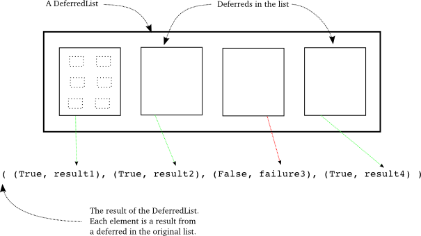

==================================
第十八部分 Deferreds 全貌
==================================
你可以从 ":doc:`p01`" 开始阅读；也可以浏览 ":doc:`index`" 的索引

简介
=========
在上一个部分,我们学习了使用生成器构造顺序异步回调的新方法.这样,包括 ``deferreds``,我们现在有两种将异步操作链接在一起的方法.

有时,然而,我们需要"并行"的运行一组异步操作.由于Twisted是单线程的,它实际并不会并发运行,但我们希望使用异步I/O在一组任务上尽可能快的工作.以我们的诗歌客户端为例,它从多个服务器同时下载诗歌,而不是一个接一个的方式.这就是使用Twisted下载诗歌的全部特点.

作为一个结果,所有诗歌客户端需要解决一个问题:你怎样得知你启动的所有异步操作已经完成?目前我们通过将结果集总到一个列表(如客户端 7.0中的 `结果 <https://github.com/jdavisp3/twisted-intro/blob/master/twisted-client-7/get-poetry.py#L160>`_ 列表)并检查这个列表的长度来解决这个问题.除了收集成功的结果,我们还必须小心地对待失败,否则一个失败将使程序进入死循环,以为还有工作需要做.

正如你所料,Twisted包含一个抽象层可以用来解决这个问题,我们来看一看.

DeferredList
===============
``DeferredList`` 类使我们可以将一个 ``defered`` 对象列表视为一个 ``defered`` 对象.通过这种方法我们启动一族异步操作并且在它们全部完成后获得通知(无论它们成功或者失败).让我们看一些例子.

在 `deferred-list/deferred-list-1.py <https://github.com/jdavisp3/twisted-intro/blob/master/deferred-list/deferred-list-1.py#L1>`_ 中,可以找到如下代码:
::

	from twisted.internet import defer

	def got_results(res):
    	    print 'We got:', res

	print 'Empty List.'
	d = defer.DeferredList([])
	print 'Adding Callback.'	
	d.addCallback(got_results)

如果运行它,将得到如下输出:
::

	Empty List.
	Adding Callback.
	We got: []

注意以下几点:

* ``DeferredList`` 由Python列表创建.在这种情况下,列表是空的,但我们很快将看到列表元素必须是 ``Deferred`` 对象.
* ``DeferredList`` 本身是一个 ``deferred`` (它继承 ``Deferred``).这意味着你可以像对待普通 ``deferred`` 一样向其添加回调和错误回调.
* 在以上例子中,回调被添加时立即激发,所以 ``DeferredList`` 也必须立即激发.我们一会儿将讨论.
* ``deferred`` 列表的结果本身也是一个列表(空).

下面看一下 `deferred-list/deferred-list-2.py <https://github.com/jdavisp3/twisted-intro/blob/master/deferred-list/deferred-list-2.py#L1>`_:
::

	from twisted.internet import defer

	def got_results(res):
    	    print 'We got:', res

	print 'One Deferred.'
	d1 = defer.Deferred()
	d = defer.DeferredList([d1])
	print 'Adding Callback.'
	d.addCallback(got_results)
	print 'Firing d1.'
	d1.callback('d1 result')

现在我们创建了包含一个 ``deferred`` 元素的 ``DeferredList`` 列表,得到如下输出:
::
	
	One Deferred.
	Adding Callback.
	Firing d1.
	We got: [(True, 'd1 result')]

注意以下几点:

* 这次 ``DeferredList`` 没有激发它的回调,直到我们激发列表中的 ``deferred``.
* 结果同样是一个列表,但这次包含一个元素.
* 这个元素是一个元组,它的第二个值是列表中 ``deferred`` 的结果.

让我们向列表添加两个 ``deferreds`` (`deferred-list/deferred-list-3.py <https://github.com/jdavisp3/twisted-intro/blob/master/deferred-list/deferred-list-1.py#L3>`_):
::

	from twisted.internet import defer

	def got_results(res):
    	    print 'We got:', res

	print 'Two Deferreds.'
	d1 = defer.Deferred()
	d2 = defer.Deferred()
	d = defer.DeferredList([d1, d2])
	print 'Adding Callback.'
	d.addCallback(got_results)
	print 'Firing d1.'
	d1.callback('d1 result')
	print 'Firing d2.'
	d2.callback('d2 result')

得到如下输出:
::

	Two Deferreds.
	Adding Callback.
	Firing d1.
	Firing d2.
	We got: [(True, 'd1 result'), (True, 'd2 result')]

现在 ``DeferredList`` 的结果非常清晰,至少以我们的使用方式,它是一个列表,元素个数与传入构造器的 ``deferred`` 列表元素个数相同. 而且结果列表的元素包含原始的 ``deferreds`` 结果信息,至少当这些 ``deferred`` 成功返回.这意味着 ``DeferredList`` 本身并不激发直到所有的原始列表中的 ``deferreds`` 都被激发. 而且以一个空列表创建的 ``DeferredList`` 会立即激发,因为它不需要等待任何 ``deferreds``.

那么最终结果列表中的元素顺序如何? 考虑以下代码( `deferred-list/deferred-list-4.py <https://github.com/jdavisp3/twisted-intro/blob/master/deferred-list/deferred-list-4.py#L1>`_):
::

	from twisted.internet import defer

	def got_results(res):
    	    print 'We got:', res

	print 'Two Deferreds.'
	d1 = defer.Deferred()
	d2 = defer.Deferred()
	d = defer.DeferredList([d1, d2])	
	print 'Adding Callback.'
	d.addCallback(got_results)
	print 'Firing d2.'
	d2.callback('d2 result')
	print 'Firing d1.'
	d1.callback('d1 result')

这里我们先激发 `d2` 然后再激发 `d1`,注意构造参数中的 ``deferred`` 列表里 `d1`, `d2` 仍是原先的顺序.输出结果如下:
::

	Two Deferreds.
	Adding Callback.
	Firing d2.
	Firing d1.
	We got: [(True, 'd1 result'), (True, 'd2 result')]

输出列表中结果的顺序与原始 ``deferred`` 列表顺序相对应,而不是 ``deferred`` 碰巧被激发的顺序.这一点非常好,因为我们可以很容易地将每个结果与生成它的相应的操作联系在一起(如哪首诗来自哪个服务器).

好了,那如果列表中一个或多个 ``deferreds`` 失败了怎么办呢? 上面结果中的 `True` 有什么用? 再看一个例子(`deferred-list/deferred-list-5.py <https://github.com/jdavisp3/twisted-intro/blob/master/deferred-list/deferred-list-5.py#L1>`_):
::

	from twisted.internet import defer

	def got_results(res):
    	    print 'We got:', res

	d1 = defer.Deferred()
	d2 = defer.Deferred()
	d = defer.DeferredList([d1, d2], consumeErrors=True)
	d.addCallback(got_results)
	print 'Firing d1.'
	d1.callback('d1 result')
	print 'Firing d2 with errback.'
	d2.errback(Exception('d2 failure'))

现在我们以正常结果激发 `d1`,以错误激发 `d2`.先暂时忽略 ``consumerErrors`` 选项,稍候介绍.这里是输出结果:
::

	Firing d1.
	Firing d2 with errback.
	We got: [(True, 'd1 result'), (False, <twisted.python.failure.Failure <type 'exceptions.Exception'>>)]

这次对应 `d2` 的元组在第二个位置出现了一个 ``Failure``,并且第一个位置是 ``False``.至此 ``DeferredList`` 的工作原理非常清晰(但继续浏览以下讨论):

* ``DeferredList`` 是以一个 ``deferred`` 对象列表创建的.
* ``DeferredList`` 本身是一个 ``deferred``,它返回的结果是一个列表,长度与 ``deferred`` 列表相同.
* 当原始列表中所有 ``deferred`` 被激发后, ``DeferredList`` 将会被激发.
* 结果列表中的每个元素以相同顺序对应原始列表中相应的 ``deferred``.如果那个 ``deferred`` 成功返回,相应元素是(`True`,result),如果失败则为(`False`,failure).
* ``DeferredList`` 不会失败,因为无论每个 ``deferred`` 的返回结果是什么都会被集总到结果列表中(同样,请看下面讨论).

现在让我们讨论一下被传入 ``DeferredList`` 的 ``consumeErrors`` 选项,如果我们运行以上相同代码而不传入此选项(`deferred-list/deferred-list-6.py <https://github.com/jdavisp3/twisted-intro/blob/master/deferred-list/deferred-list-6.py#L1>`_),则得到以下输出:
::

	Firing d1.
	Firing d2 with errback.
	We got: [(True, 'd1 result'), (False, >twisted.python.failure.Failure >type 'exceptions.Exception'<<)]
	Unhandled error in Deferred:
	Traceback (most recent call last):
	Failure: exceptions.Exception: d2 failure

如果你还记得,"Unhandled error in Deferred"消息是在 ``deferred`` 垃圾回收时被生成的,而且它表示最后一个回调失败了.这个消息告诉我们并没有完全捕获潜在的异步错误.在我们例子中,它是从哪里来的呢? 很明显不是来自 ``DeferredList``,因为它已经成功返回了.所以它一定是来自 `d2`.

``DeferredList`` 需要知道它所监视的 ``deferred`` 何时激发. ``DeferredList`` 以通常的方式向每个 ``deferred`` 添加一个回调和错误回调. 默认地,这个回调(或错误)返回原始结果(或错误)在将它们放入最终结果列表之后.由于错误回调返回原始 ``failure`` 后将触发下一个错误回调, `d2` 在它被激发后仍然保持失败状态.

但是如果我们将 `consumeErrors=True` 传递给 ``DeferredList``, 它将向每个 ``deferred`` 添加返回 `None` 的错误回调, 即"消耗"掉这个错误并且取消警告信息. 我们同样可以向 `d2` 添加自己的错误回调来处理错误,如 `deferred-list/deferred-list-7.py <https://github.com/jdavisp3/twisted-intro/blob/master/deferred-list/deferred-list-7.py#L1>`_.

客户端 8.0
================
获取诗歌客户端8.0发布啦！客户端使用 ``DeferredList`` 去发现所有诗歌何时完成(或失败).新版客户端位于 `twisted-client-8/get-poetry.py <https://github.com/jdavisp3/twisted-intro/blob/master/twisted-client-8/get-poetry.py#L1>`_. 同样,唯一的变化在于 `poetry_main <https://github.com/jdavisp3/twisted-intro/blob/master/twisted-client-8/get-poetry.py#L151>`_, 我们来看一下重要的变化:
::

	...
	ds = []

	for (host, port) in addresses:
    	    d = get_transformed_poem(host, port)
    	    d.addCallbacks(got_poem)
    	    ds.append(d)

	dlist = defer.DeferredList(ds, consumeErrors=True)
	dlist.addCallback(lambda res : reactor.stop())
 
你可以与 `客户端 7.0 <https://github.com/jdavisp3/twisted-intro/blob/master/twisted-client-7/get-poetry.py#L180>`_ 中的相应部分比较.

在客户端 8.0中,我们不需要 `poem_done` 回调和 `results` 列表.相反,我们把每个从 `get_transformed_poem` 返回的 ``deferred`` 放入 `ds` 列表,之后创建一个 ``DeferredList``.由于 ``DeferredList`` 不会在所有诗歌完成或失败之前激发,我们仅仅向 ``DeferredList`` 添加一个回调以便关闭 ``reactor``. 在我们这个情况中,没有使用 ``DeferredList`` 返回的结果,我们仅仅需要知道所有事情何时结束.仅此而已!

讨论
=========
可视化 ``DeferredList`` 的工作方式:

.. _figure37:

|    图37: ``DeferredList`` 的结果

非常简单,真的. 还有一些关于 ``DeferredList`` 的选项我们没有涉及,以及那些改变我们以上所描述行为的选项.我们在参考练习中把这些留给读者自己探索.

在 :doc:`p19` 中我们将进一步介绍 ``Deferred`` 类, 包括 Twisted 10.1.0 提出的最新特性.

参考练习
============
1. 阅读 ``DeferredList`` 的源代码.
2. 修改 `deferred-list` 中的例子去实现可选的构造器参数 ``fireOnOneCallback`` 和 ``fireOnOneErrback``. 实现你将用其中一个(或两个都使用)的情景.
3. 你可以使用 ``DeferredLists`` 列表创建一个 ``DeferredList`` 吗? 如果是这样,结果将是什么?
4. 修改客户端8.0在所有诗歌完成下载前不打印任意信息. 这次你将使用 ``DeferredList`` 的结果.
5. 定义 ``DeferredDict`` 的句法并且实现它.
