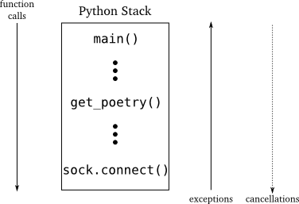
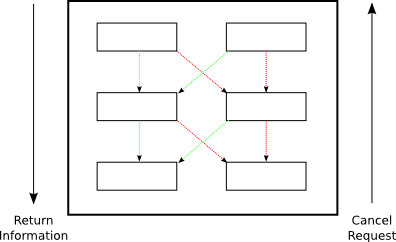

===========================
 第十九部分 改变之前的想法
===========================
你可以从 ":doc:`p01`" 开始阅读；也可以从 ":doc:`index`" 浏览索引.

简介
====
| Twisted是一个正在进展的项目,它的开发者会定期添加新的特性并且扩展旧的特性.
| 随着Twisted 10.1.0发布,开发者向 ``Deferred`` 类添加了一个新的特性—— ``cancellation`` ——这正是我们今天要研究的.

异步编程将请求和响应解耦了,如此又带来一个新的可能性:在请求结果和返回结果之间,你可能决定不再需要这个结果了.考虑一下 :doc:`p14` 中的诗歌代理服务器.下面是这个如何工作的,至少对于诗歌的第一次请求:

1. 一个对诗歌的请求来了.
2. 这个代理联系实际服务器以得到这首诗
3. 一旦这首诗完成,将其发送给原发出请求的代理

看起来非常完美,但是如果客户端在获得诗歌之前挂了怎么办?也许它们先前请求 `Paradise Lost <http://www.online-literature.com/milton/paradiselost/>`_ 的全部内容,随后它们决定实际想要的是 `Kojo <http://www.toyomasu.com/haiku/#kojo>`_ 的俳句.我们的代理将陷入下载前者,并且那个慢服务器会等好一会.最好的策略便是关闭连接,让慢服务器回去顺觉.

回忆一下 :ref:`figure15`,展示了同步程序控制流的概念.在那张图中我们可以看到函数调用自上而下,异常是自下而上.如果我们希望取消一个同步调用(这仅是假设),控制流的传递方向与函数调用的方向一致,都是从高层传向底层,如图38所示:

.. _figure38:

|  图38:同步程序流,含假想取消操作

当然,在同步程序中这是不可能的,因为高层的代码在底层操作结束前没有恢复运行,自然也就没有什么可取消的.但是在异步程序中,高层代码在底层代码完成前具有控制权,至少具有在底层代码完成之前取消它的请求的可能性.

在Twisted程序中,底层请求被包含在一个 ``Deferred`` 对象中,你可以将其想象为一个外部异步操作的"句柄". ``deferred`` 中正常的信息流是向下的,从底层代码到高层代码,与同步程序中返回的信息流方向一致.从Twisted 10.1.0开始,高层代码可以反向发送信息 —— 它可以告诉底层代码它不再需要其结果了.如图39:

.. _figure39:

|    图39： ``deferred`` 中的信息流,包含取消

取消 ``Deferreds``
==================
让我们看一些例程,来了解下取消 ``deferreds`` 的实际工作原理.注:为了运行这些列子以及本部分中的其他代码,你需要安装Twisted 10.1.0或更高 `版本 <http://twistedmatrix.com/trac/wiki/Downloads>`_. 考虑 `deferred-cancel/defer-cancel-1.py <https://github.com/jdavisp3/twisted-intro/blob/master/deferred-cancel/defer-cancel-1.py#L1>`_:
::

	from twisted.internet import defer

	def callback(res):
    	    print 'callback got:', res

	d = defer.Deferred()
	d.addCallback(callback)
	d.cancel()
	print 'done'

伴随着新的取消特性, ``Deferred`` 类获得一个名为 ``cancel`` 的新方法.上面代码创建了一个新的 ``deferred``,添加了一个回调,这后取消了这个 ``deferred`` 而没有激发它.输出如下:
::

	done
	Unhandled error in Deferred:
	Traceback (most recent call last):
	Failure: twisted.internet.defer.CancelledError:

OK,取消一个 ``deferred`` 看起来像使错误回调链运行,常规的回调根本没有被调用.同样注意到这个错误是: `twisted.internet.defer.CancelledError`,一个意味着 ``deferred`` 被取消的个性化异常(但请继续阅读).让我们添加一个错误回调,如 `deferred-cancel/defer-cancel-2.py <https://github.com/jdavisp3/twisted-intro/blob/master/deferred-cancel/defer-cancel-2.py#L1>`_
::

	from twisted.internet import defer

	def callback(res):
    	    print 'callback got:', res
 
	def errback(err):
    	    print 'errback got:', err
 
	d = defer.Deferred()
	d.addCallbacks(callback, errback)
	d.cancel()
	print 'done'

得到以下输出:
::

	errback got: [Failure instance: Traceback (failure with no frames): <class 'twisted.internet.defer.CancelledError'>:
	]
	done

所以我们可以'捕获'从 ``cancel`` 产生的错误回调,就像其他 ``deferred`` 错误一样.

OK,让我们试试激发 ``deferred`` 然后取消它,如 `deferred-cancel/defer-cancel-3.py <https://github.com/jdavisp3/twisted-intro/blob/master/deferred-cancel/defer-cancel-3.py#L1>`_:
::

	from twisted.internet import defer
 
	def callback(res):
    	    print 'callback got:', res
 
	def errback(err):
    	    print 'errback got:', err
 
	d = defer.Deferred()
	d.addCallbacks(callback, errback)
	d.callback('result')
	d.cancel()
	print 'done'

这里我们用常规 ``callback`` 方法激发 ``deferred``,之后取消它.输出结果如下:
::
	
	callback got: result
	done

我们的回调被调用(正如我们所预期的)之后程序正常结束,就像 ``cancel`` 根本没有被调用.所以取消一个 ``deferred`` 好像根本没有效果如果它已经被激发(但请继续阅读!).

如果我们在取消 ``deferred`` 之后激发它会怎样?参看 `deferred-cancel/defer-cancel-4.py <https://github.com/jdavisp3/twisted-intro/blob/master/deferred-cancel/defer-cancel-4.py#L1>`_:
::

	from twisted.internet import defer

	def callback(res):
    	    print 'callback got:', res
 
	def errback(err):
    	    print 'errback got:', err
 
	d = defer.Deferred()
	d.addCallbacks(callback, errback)
	d.cancel()
	d.callback('result')
	print 'done'

这种情况的输出如下:
::

	errback got: [Failure instance: Traceback (failure with no frames): <class 'twisted.internet.defer.CancelledError'>:
	]	
	done

有意思！与第二个例子的输出一样,当时没有激发 ``deferred``.所以如果 ``deferred`` 被取消了,再激发它没有效果.但是为什么 `d.callback('result')` 没有产生错误,考虑到不能激发 ``deferred`` 大于一次,错误回调链为何没有运行?

再次考虑 `figure39`_.用结果或失败激发一个 ``deferred`` 是底层代码的工作,然而取消 ``deferred`` 是高层代码的行为.激发 ``deferred`` 意味着"这是你的结果",然而取消 ``deferred`` 意味着"我不再想要这个结果了".同时记住 ``cancel`` 是一个新特性,所以大部分现有的Twisted代码并没有处理取消的操作.但是Twisted的开发者使我们取消 ``deferred`` 的想法变得有可能,甚至包括那些在Twisted 10.1.0之前写的代码.

为了实现以上想法, ``cancel`` 方法实际上做两件事:

1. 告诉 ``Deferred`` 对象本身你不想要那个结果,如果它还没有返回(如, ``deferred`` 没有被激发),这样忽略任何回调或错误回调的后续调用.
2. 同时,可选地,告诉正在产生结果的底层代码需要采取何种步骤来取消操作.

由于旧版本的Twisted代码会上前去激发任何已经被取消的 ``deferred``, step#1确保我们的程序不会垮掉如果我们取消一个旧有库中的 ``deferred``.

这意味着我们可以随心所欲地取消一个 ``deferred``,同时可以确定不会得到结果如果它还没有到来(甚至那些 **将要** 到来的).但是取消 ``deferred`` 可能并没有取消异步操作.终止一个异步操作需要一个上下文的具体行动.你可能需要关闭网络连接,回滚数据库事务,结束子进程,等等.由于 ``deferred`` 仅仅是一般目的的回调组织者,它怎么知道具体要做什么当你取消它时?或者,换种说法,它怎样将 ``cancel`` 请求传递给首先已经创建和返回了 ``deferred`` 的底层代码? 和我一起说:
::

	I know, with a callback!

本质上取消 ``Deferreds``
========================
好吧,首先看一下 `deferred-cancel/defer-cancel-5.py <https://github.com/jdavisp3/twisted-intro/blob/master/deferred-cancel/defer-cancel-5.py#L1>`_:
::

	from twisted.internet import defer

	def canceller(d):
    	    print "I need to cancel this deferred:", d
 
	def callback(res):
    	    print 'callback got:', res
 
	def errback(err):
    	    print 'errback got:', err
 
	d = defer.Deferred(canceller) # created by lower-level code
	d.addCallbacks(callback, errback) # added by higher-level code
	d.cancel()
	print 'done'

这个例子基本上跟第二个例子相同,除了有第三个回调(``canceller``).这个回调是我们在创建 ``Deferred`` 的时候传递给它的,不是之后添加的.这个回调负责执行终止异步操作时所需的上下文相关的具体操作(当然,仅当 ``deferred`` 被实际取消). ``canceller`` 回调是返回 ``deferred``  的底层代码的必要部分,不是接收 ``deferred`` 的高层代码为其自己添加的回调和错误回调.

运行这个例子将产生如下输出:
::

	I need to cancel this deferred: <Deferred at 0xb7669d2cL>
	errback got: [Failure instance: Traceback (failure with no frames): <class 'twisted.internet.defer.CancelledError'>:
	]
	done

正如你所看到, 不需要返回结果的 ``deferred`` 被传递给 ``canceller`` 回调.在这里我们可以做任何需要做的事情以便彻底终止异步操作.注意 ``canceller`` 在错误回调链激发前被调用.其实我们可以在取消回调中选择使用任何结果或错误自己激发 ``deferred`` (这样就会优先于 ``CancelledError`` 失败).这两种情况在 `deferred-cancel/defer-cancel-6.py <https://github.com/jdavisp3/twisted-intro/blob/master/deferred-cancel/defer-cancel-6.py#L1>`_  和 `deferred-cancel/defer-cancel-7.py <https://github.com/jdavisp3/twisted-intro/blob/master/deferred-cancel/defer-cancel-7.py#L1>`_ 中进行了说明.

在激发 ``reactor`` 之前先做一个简单的测试.我们将使用 ``canceller`` 回调创建一个 ``deferred``,正常的激发它,之后取消它.你可以在 `deferred-cancel/defer-cancel-8.py <https://github.com/jdavisp3/twisted-intro/blob/master/deferred-cancel/defer-cancel-8.py#L1>`_ 中看到代码.通过检查那个脚本的输出,你将看到取消一个被激发的 ``deferred`` 不会调用 ``canceller`` 回调.这正是我们所要的,因为没什么可取消的.

|  我们目前看到的例子都没有实际的异步操作. 让我们构造一个调用异步操作的简单程序,之后我们将指出如何使那个操作可取消.
|  参见代码 `deferred-cancel/defer-cancel-9.py <https://github.com/jdavisp3/twisted-intro/blob/master/deferred-cancel/defer-cancel-9.py#L1>`_:
::

	from twisted.internet.defer import Deferred

	def send_poem(d):
    	    print 'Sending poem'
    	    d.callback('Once upon a midnight dreary')
 
	def get_poem():
    	    """Return a poem 5 seconds later."""
    	    from twisted.internet import reactor
    	    d = Deferred()
    	    reactor.callLater(5, send_poem, d)
    	    return d
 
	def got_poem(poem):
    	    print 'I got a poem:', poem
 
	def poem_error(err):
    	    print 'get_poem failed:', err
 
	def main():
    	    from twisted.internet import reactor
    	    reactor.callLater(10, reactor.stop) # stop the reactor in 10 seconds
 
	    d = get_poem()
    	    d.addCallbacks(got_poem, poem_error)
 
	    reactor.run()
 
	main()

这个例子中包含了一个 `get_poem` 函数,它使用 ``reactor`` 的 ``callLater`` 方法在被调用5秒钟后异步地返回一首诗.主函数调用 `get_poem`,添加一个回调/错误回调对,之后启动 ``reactor``.我们(同样使用 ``callLater``)安排 ``reactor`` 在10秒钟之后停止.通常我们向 ``deferred`` 添加一个回调来实现,但你很快就会知道我们为何这样做.

运行程序(适当延迟后)产生如下输出:
::

	Sending poem
	I got a poem: Once upon a midnight dreary

10秒钟后程序终止.现在来试试在诗歌被发送前取消 ``deferred``.只需加入以下代码在2秒钟后取消(在5秒钟延迟发送诗歌之前):
::

	 reactor.callLater(2, d.cancel) # cancel after 2 seconds 

完整的例子参见 `deferred-cancel/defer-cancel-10.py <https://github.com/jdavisp3/twisted-intro/blob/master/deferred-cancel/defer-cancel-10.py#L1>`_,这将产生如下输出:
::
	get_poem failed: [Failure instance: Traceback (failure with no frames): <class 'twisted.internet.defer.CancelledError'>:
	]
	Sending poem

这个例子清晰地展示了取消一个 ``deferred`` 并没有取消它背后的异步请求.2秒钟后我们看到了错误回调输出,打印出如我们所料的 ``CancelledError`` 错误.但是5秒钟后我们看到了 `send_poem` 的输出(但是这个 ``deferred`` 上的回调并没有激发).

这时我们与 `deferred-cancel/defer-cancel-4.py <https://github.com/jdavisp3/twisted-intro/blob/master/deferred-cancel/defer-cancel-4.py#L1>`_ 的情况一样."取消" ``deferred`` 仅仅是使最终结果被忽略,但实际上并没有终止这个操作.正如我们上面所学,为了得到一个真正可取消的 ``deferred``,必须在它被创建时添加一个 ``cancel`` 回调.

那么这个新的回调需要做什么呢? 参考一下关于 ``callLater`` 方法的 `文档 <http://twistedmatrix.com/trac/browser/tags/releases/twisted-10.1.0/twisted/internet/interfaces.py#L556>`_. 它的返回值是另一个实现了 ``IDelayedCall`` 的对象,用 ``cancel`` 方法我们可以阻止延迟的调用被执行.

这非常简单,更新后的代码参见 `deferred-cancel/defer-cancel-11.py <https://github.com/jdavisp3/twisted-intro/blob/master/deferred-cancel/defer-cancel-11.py#L1>`_.所有相关变化都在 `get_poem` 函数中:
::

	def get_poem():
    	    """Return a poem 5 seconds later."""

	def canceler(d):
            # They don't want the poem anymore, so cancel the delayed call
            delayed_call.cancel()
 
	    # At this point we have three choices:
            #   1. Do nothing, and the deferred will fire the errback
            #      chain with CancelledError.
            #   2. Fire the errback chain with a different error.
            #   3. Fire the callback chain with an alternative result.
 
	d = Deferred(canceler)
 
	from twisted.internet import reactor
    	delayed_call = reactor.callLater(5, send_poem, d)
 
	return d

在这个新版本中,我们保存 ``callLater`` 的返回值以便能够在 ``cancel`` 回调中使用. ``cancel`` 回调的唯一工作是调用 `delayed_call.cancel()`. 但是正如之前讨论的,我们可以选择激发自定义的 ``deferred``. 最新版本的程序产生如下输出:
::

	get_poem failed: [Failure instance: Traceback (failure with no frames): <class 'twisted.internet.defer.CancelledError'>:
	]

正如你看到的, ``deferred`` 被取消了并且异步操作被真正地终止了(我们看不到 `send_poem` 的输出了).

诗歌代理 3.0
===============
正如在简介中所讨论,诗歌代理服务器是实现取消的很好的候选者,因为这可以让我们取消诗歌下载如果事实证明没有人想要它(如客户端已经在我们发送诗歌前关闭了连接).版本 3.0的代理位于 `twisted-server-4/poetry-proxy.py <https://github.com/jdavisp3/twisted-intro/blob/master/twisted-server-4/poetry-proxy.py#L1>`_,实现了 ``deferred`` 取消. 变化首先位于 `PoetryProxyProtocol <https://github.com/jdavisp3/twisted-intro/blob/master/twisted-server-4/poetry-proxy.py#L52>`_:
::

	class PoetryProxyProtocol(Protocol):

	    def connectionMade(self):
            	self.deferred = self.factory.service.get_poem()
            	self.deferred.addCallback(self.transport.write)
            	self.deferred.addBoth(lambda r: self.transport.loseConnection())
 
	   def connectionLost(self, reason):
               if self.deferred is not None:
               	   deferred, self.deferred = self.deferred, None
            	   deferred.cancel() # cancel the deferred if it hasn't fired

你可以与 `旧版本 <https://github.com/jdavisp3/twisted-intro/blob/master/twisted-server-2/poetry-proxy.py#L52>`_ 对比一下.两个主要的变化是:

1. 保存我们从 `get_poem` 得到的 ``deferred``,以便之后在需要时取消它.
2. 当连接关闭时取消 ``deferred``.注这个操作同样会取消 ``deferred`` 当我们实际得到诗歌之后,但正如前例所发现的,取消一个被激发的 ``deferred`` 不会有任何效果. 

现在我们需要确保取消 ``deferred`` 将实际终止诗歌的下载. 所以我们需要改变 `ProxyService <https://github.com/jdavisp3/twisted-intro/blob/master/twisted-server-4/poetry-proxy.py#L105>`_:
::

	class ProxyService(object):

	    poem = None # the cached poem
 
	    def __init__(self, host, port):
            	self.host = host
        	self.port = port
 
	    def get_poem(self):
            	if self.poem is not None:
            	   print 'Using cached poem.'
            	   # return an already-fired deferred
            	   return succeed(self.poem)
 
		def canceler(d):
            	    print 'Canceling poem download.'
            	    factory.deferred = None
            	    connector.disconnect()
 
		print 'Fetching poem from server.'
            	deferred = Deferred(canceler)
            	deferred.addCallback(self.set_poem)
            	factory = PoetryClientFactory(deferred)
            	from twisted.internet import reactor
            	connector = reactor.connectTCP(self.host, self.port, factory)
            	return factory.deferred
 
	    def set_poem(self, poem):
            	self.poem = poem
            	return poem

同样,可以与 `旧版本 <https://github.com/jdavisp3/twisted-intro/blob/master/twisted-server-2/poetry-proxy.py#100>`_ 对比一下. 这个类具有一些新的变化:

1. 我们保存 `reactor.connetTCP` 的返回值,一个 `IConnector <http://twistedmatrix.com/trac/browser/tags/releases/twisted-10.1.0/twisted/internet/interfaces.py#L24>`_ 对象.我们可以使用这个对象上的 ``disconnect`` 方法关闭连接.
2. 我们创建带 ``canceler`` 回调的 ``deferred``.那个回调是一个闭包,它使用 ``connector`` 关闭连接. 但首先须设置 `factory.deferred` 属性为 `None`. 否则,工厂会以 "连接关闭"错误回调激发 ``deferred`` 而不是以 ``CancelledError`` 激发. 由于 ``deferred`` 已经被取消了, 以 ``CancelledError`` 激发更加合适.

你同样会注意到我们是在 ``ProxyService`` 中创建 ``deferred`` 而不是 ``PoetryClientFactory``. 由于 ``canceler`` 回调需要获取 ``IConnector`` 对象, ``ProxyService`` 成为最方便创建 ``deferred`` 的地方.

同时,就像我们之前的例子, ``canceler`` 回调作为一个闭包实现.闭包看起来在取消回调的实现上非常有用.

让我们试试新的代理.首先启动一个慢服务器.它需要很慢以便我们有时间取消:
::
	
	python blocking-server/slowpoetry.py --port 10001 poetry/fascination.txt

现在可以启动代理(记住你需要Twisted 10.1.0):
::

	python twisted-server-4/poetry-proxy.py --port 10000 10001						     
现在我们可以用任何客户端从代理下载一首诗,或者仅使用 `curl`:
::

	curl localhost:10000

几秒钟后,按 ``Ctrl-C`` 停止客户端或者 `curl` 进程. 在终端运行代理你将看到如下输出:
::

	Fetching poem from server.
	Canceling poem download.

| 你应该看到慢服务器已经停止了向输出打印它所发送诗歌的片段,因为我们的代理挂了.
| 你可以多次启动和停止客户端来证实每个下载每次都被取消了.但是如果你让整首诗运行完,那么代理将缓存它并且在此之后立即发送它.

另一个难点
===========
以上我们曾不止一次说取消一个已经激发的 ``deferred`` 是没有效果的.然而,这不是十分正确.在 :doc:`p13` 中,我们学习了附加给一个 ``deferred`` 的回调和错误回调也可能返回另一个 ``deferred``.在那种情况下,原始的(外层) ``deferred`` 暂停执行它的回调链并且等待内层 ``deferred`` 激发(参见 `figure28`_).

如此, 即使一个 ``deferred`` 激发了发出异步请求的高层代码,它也不能接收到结果,因为在等待内层 ``deferred`` 完成之前回调链暂停了. 所以当高层代码取消这个外部 ``deferred`` 时会发生什么情况呢? 在这种情况下,外部 ``deferred`` 不仅仅是取消它自己(它已经激发了);相反地,这个 ``deferred`` 取消内部的 ``deferred``.

所以当你取消一个 ``deferred`` 时,你可能不是在取消主异步操作,而是一些其他的作为前者结果所触发的异步操作.呼!

我们可以用一个例子来说明.考虑代码 `deferred-cancel/defer-cancel-12.py <https://github.com/jdavisp3/twisted-intro/blob/master/deferred-cancel/defer-cancel-12.py#L1>`_:
::

	from twisted.internet import defer
 
	def cancel_outer(d):
    	    print "outer cancel callback."
 
	def cancel_inner(d):
    	    print "inner cancel callback."
 
	def first_outer_callback(res):
    	    print 'first outer callback, returning inner deferred'
    	    return inner_d
 
	def second_outer_callback(res):
    	    print 'second outer callback got:', res
 
	def outer_errback(err):
    	    print 'outer errback got:', err
 
	outer_d = defer.Deferred(cancel_outer)
	inner_d = defer.Deferred(cancel_inner)
 
	outer_d.addCallback(first_outer_callback)
	outer_d.addCallbacks(second_outer_callback, outer_errback)
 
	outer_d.callback('result')
 
	# at this point the outer deferred has fired, but is paused
	# on the inner deferred.
 
	print 'canceling outer deferred.'
	outer_d.cancel()
 
	print 'done'

在这个例子中,我们创建了两个 ``deferred``, `outer` 和 `inner`,并且有一个外部回调返回内部 ``deferred``. 首先,我们激发外部 ``deferred``,然后取消它. 输出结果如下:
::

	first outer callback, returning inner deferred
	canceling outer deferred.
	inner cancel callback.
	outer errback got: [Failure instance: Traceback (failure with no frames): <class 'twisted.internet.defer.CancelledError'>:
	]
	done

正如你看到的,取消外部 ``deferred`` 并没有使外部 ``cancel`` 回调被激发. 相反,它取消了内部 ``deferred``,所以内部 ``cancel`` 回调被激发了,之后外部错误回调收到 ``CancelledError`` (来自内部 ``deferred``).

你可能需要仔细看一看那些代码,并且做些变化看看如何影响结果.

讨论
======
取消 ``deferred`` 是非常有用的操作,使我们的程序避免去做不需要的工作. 然而正如我们看到的,它可能有一点点棘手.

需要明白的一个重要事实是取消一个 ``deferred`` 并不意味着取消了它后面的异步操作.事实上,当写这篇文章时,很多 ``deferreds`` 并不会被真的"取消",因为大部分Twisted代码写于Twisted 10.1.0之前并且还没有被升级.这包括很多Twisted本身的APIs！检查文档或源代码去发现"取消 ``deferred``"是否真的取消了背后的请求,还是仅仅忽略它.

第二个重要事实是从你的异步APIs返回的 ``deferred`` 并不一定在完整意义上可取消. 如果你希望在自己的程序中实现取消,你应该先研究一下Twisted源代码中的许多例子. ``Cancellation`` 是一个暂新的特性,所以它的模式和最好实践还在制定当中.

展望未来
=========
现在我们已经学习了关于 ``Deferreds`` 的方方面面以及Twisted背后的核心概念. 这意味着我们没什么需要介绍的了,因为Twisted的其余部分主要包括一些特定的应用,如网络编程或异步数据库处理.故而,在 `接下来 <p20.html>`_ 的部分中,我们想走点弯路,看看其他两个使用异步I/O的系统跟Twisted有何理念相似之处.之后,在尾声中,我们会打个包并且建议一些帮助你继续学习Twisted的方法.

参考练习
=========
1. 你知道你可以用多种方式拼写"`cancelled`"吗? `真的 <http://mw4.m-w.com/dictionary/canceled>`_. 这取决于你的心情.
2. 细读 `Deferred <http://twistedmatrix.com/trac/browser/tags/releases/twisted-10.1.0/twisted/internet/defer.py#L167>`_ 类的源代码,关注 ``cancellation`` 的实现.
3. 在Twisted 10.1.0的 `源码 <http://twistedmatrix.com/trac/browser/tags/releases/twisted-10.1.0/>`_ 中找具有取消回调的 ``deferred`` 的例子.研究它们的实现.
4. 修改我们诗歌客户端中 `get_poetry` 方法返回的 ``deferred``, 使其可取消.
5. 做一个基于 `reactor` 的例子展示取消外部 ``deferred``,它被内层 ``deferred`` 暂停了.如果使用 ``callLater`` 你需要小心选择延迟时间,以确保外层 ``deferred`` 在正确的时刻被取消.
6. 找一个 Twisted 中还不支持"本质上取消操作"的异步API,为它实现本质取消. 并向 Twisted项目 提交一个 `补丁 <http://twistedmatrix.com/trac/wiki/BasicGuideToContributingCode>`_.不要忘记单元测试!
