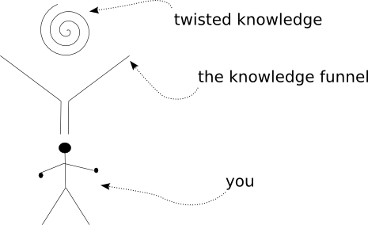

========================
第二十二部分 结束
========================
你可以从":doc:`p01`"开始阅读；也可以浏览":doc:`index`"的索引

全部完成
==========
呼呼！ 感谢你一路支持. 在我开始时完全没有想到这个系列会这样长,会花这么多时间完成,但是创建这个系列的过程使我非常享受,也希望你喜欢它.

既然我已经完成了,我会进一步考虑将其转化为PDF格式.然而,不保证.

最后,我想总结一些帮助你继续学习Twisted的建议.

进一步阅读
==============
首先,我建议阅读Twisted的 `在线文档 <http://twistedmatrix.com/trac/wiki/Documentation>`_. 虽然它备受指责,但我觉得这总比饱受赞誉要好.

如果你希望使用Twisted进行网络编程, 那么 **Jean-Paul Calderone** 的广受关注的系列 `Twisted网络编程60秒 <http://jcalderone.livejournal.com/50562.html>`_ 是不错的选择. 虽然我觉得60秒可能读不完.

但比以上更重要的是,我认为,是阅读Twisted `源码 <http://twistedmatrix.com/trac/browser/trunk>`_, 因为这些源码是被非常熟悉Twisted的人写的,其中的任何例子都会告诉你怎样用"Twisted的方式"做事情.

参考练习
==============
1. 将你写过的一个同步程序转化为使用Twisted.
2. 从零开始,写一个Twisted程序.
3. 从Twisted的 `错误数据库 <http://twistedmatrix.com/trac/report>`_ 拾起一个错误,并修改它. 给Twisted的开发者提交一个补丁, 不要忘记阅读贡献源代码的 `操作流程 <http://twistedmatrix.com/trac/wiki/ContributingToTwistedLabs>`_.

真的要结束了
==============
祝你编码快乐!

.. _figure47:

|       图47: 结束
